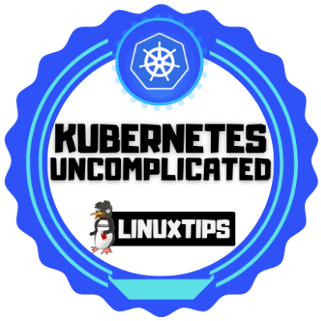

# Kubernetes #
This is my portifolio with all my knowledge and projects realted to Kubernetes (k8s)

## 🌐 Oficial Documentation ##
1. [Kubernetes](https://kubernetes.io/)
2. [Kubernetes docs](https://kubernetes.io/docs/home/)

---

## Projects and Repositories ##

1.  [Kubernetes for the Absolute Beginners – Hands-on](https://kodekloud.com/courses/docker-swarm-services-stacks-hands-on/)
    1.  * [ ] 💥 Refactor the repositorie
2.  [Kubernetes cluster on OCI with Terraform](https://github.com/PedroDevOps/ampernetacle.git)
---

## Courses & Certifications ##

1. [Kubernetes for the Absolute Beginners – Hands-on](https://kodekloud.com/certificate-verification/7A51559BCD-7A4B5ED328-7A45C540A5/)
2. [Certified Kubernetes Application Developer (CKAD)](https://kodekloud.com/courses/certified-kubernetes-application-developer-ckad/)
   1. * [ ] 💥 Remove the link to the course and link it to my certification
3. [Certified Kubernetes Administrator (CKA)](https://kodekloud.com/courses/certified-kubernetes-administrator-cka/)
   1. * [ ] 💥 Remove the link to the course and link it to my certification
4. [Certified Kubernetes Security Specialist (CKS)](https://kodekloud.com/courses/certified-kubernetes-security-specialist-cks/)
   1. * [ ] 💥 Remove the link to the course and link it to my certification
5. [Game of PODs](https://kodekloud.com/courses/game-of-pods/)
   1. * [ ] 💥 Remove the link to the course and link it to my certification
6. [Uncomplicating Kubernetes](https://www.credential.net/44dfd773-b017-4c9c-80b1-9cb36bb5b22a#gs.tkx3nd)

---

## Badges ##
<table width="100%" border="0">
  <tr>    
  <td></td>
  <td></td>
  <td></td>
  </tr>
</table>
---

## Badges Wallets & Accounts ##
1.  [Credly](https://www.credly.com/users/pedro-o-azevedo/badges)
2.  [Accredible Credential.net](https://sgq.io/nBjo4og)

