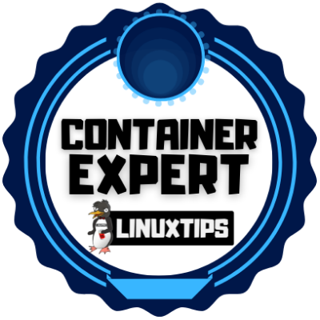
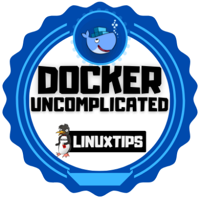

# Docker #
This is my portifolio with all my knowledge and projects realted specifically to Docker

## 🌐 Oficial Documentation ##
1. [Docker](https://www.docker.com/)
2. [Docker docs](https://docs.docker.com/)

## Projects and Repositories ##

1.  [Uncomplicating Docker](https://github.com/PedroDevOps/DescomplicandoKubernetes)
    1.  * [ ] 💥 Refactor the repositorie
2.  [Docker: Containers Administration - DCA](https://github.com/PedroDevOps/540)
    1.  * [ ] 💥 Refactor the repositorie
3.  [Docker Samples: Example Voting App](https://github.com/dockersamples/example-voting-app)
    1.  * [ ] 💥 Refactor the repositorie
4.  * [ ] 💥 create some repo examples from docker docs (TO-DO)

## Courses & Certifications ##

1. [Container Expert](https://www.credential.net/234b6777-98f2-47b5-968b-9b0e550cccbc#gs.sh7nnf)
1. [Uncomplicating Docker](https://www.credential.net/4298a505-33d8-4c16-adda-ad33a4afad05#gs.sh827m)
2. [Docker Essentials: A Developer Introduction](https://courses.cognitiveclass.ai/certificates/a0d12268b2b54a88abb43b23eed2a806)
3. [Docker: Containers Administration - DCA](https://github.com/4linux/540)
   1. * [ ] 💥 Remove the link to github and link it to my certification
4. [Docker for the Absolute Beginner](https://kodekloud.com/certificate-verification/7A51559BCD-7A4B5ED071-7A45C540A5/)

## Badges ##
<table width="100%" border="0">
  <tr>    
  <td></td>
  <td></td>
  <td></td>
  </tr>
</table>

## Badges Wallets & Accounts ##
1.  [Credly](https://www.credly.com/users/pedro-o-azevedo/badges)
2.  [Accredible Credential.net](https://sgq.io/nBjo4og)

