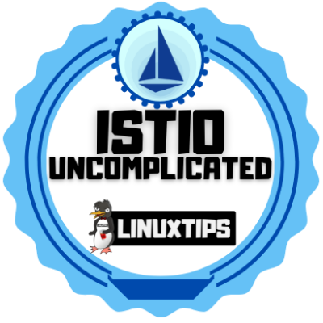

# Istio #
This is my portifolio with all my knowledge and projects realted to Istio

## 🌐 Oficial Documentation ##
1. [Istio](https://mesos.apache.org/)
2. [Istio docs](https://mesos.apache.org/documentation/latest/)

---

## Projects and Repositories ##

1.  [Uncomplicating Istio](https://github.com/PedroDevOps/DescomplicandoIstio)
    1.  * [ ] 💥 Refactor the repositorie
2.  * [ ] 💥 create some repo examples from docker docs (TO-DO)

---

## Courses & Certifications ##

1. [Uncomplicating Istio](https://www.credential.net/470e844e-4f06-4631-942e-d1438148a9d2#gs.tl4skq)

---

## Badges ##
<table width="100%" border="0">
  <tr>    
  <td></td>
  <td></td>
  <td></td>
  </tr>
</table>
---

## Badges Wallets & Accounts ##
1.  [Credly](https://www.credly.com/users/pedro-o-azevedo/badges)
2.  [Accredible Credential.net](https://sgq.io/nBjo4og)

