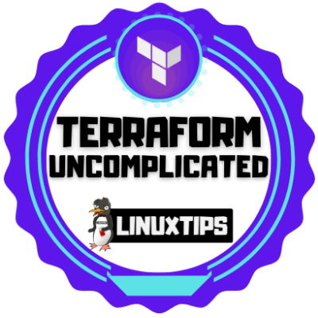

# Terraform #
This is my portifolio with all my knowledge and projects realted to Terraform

## 🌐 Oficial Documentation ##
1. [Terraform](https://www.terraform.io/)
2. [Terraform Docs](https://www.terraform.io/docs)
3. [Terraform Learn](https://learn.hashicorp.com/terraform)

---

## Projects and Repositories ##

1.  [Terraform simple VM on AWS](https://github.com/PedroDevOps/Terraform-simple-VM-on-AWS)
    1.  * [ ] 💥 Finishi it!
2.  [Kubernetes cluster on OCI with Terraform](https://github.com/PedroDevOps/ampernetacle.git)

---

## Courses & Certifications ##

1. [Uncomplicating Terraform](https://api.accredible.com/v1/frontend/credential_website_embed_image/certificate/30092090)

---

## Badges ##
<table width="100%" border="0">
  <tr>    
  <td></td>
  </tr>
</table>
---

## Badges Wallets & Accounts ##
1.  [Credly](https://www.credly.com/users/pedro-o-azevedo/badges)
2.  [Accredible Credential.net](https://sgq.io/nBjo4og)

