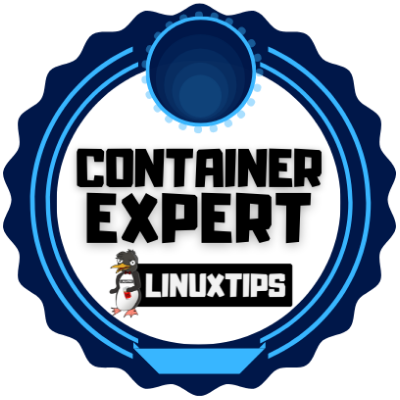
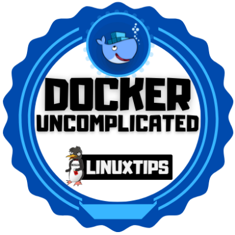
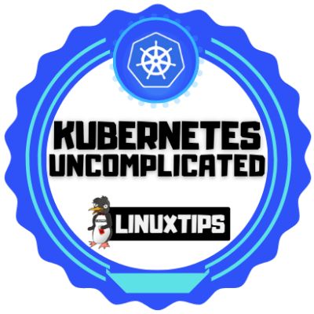
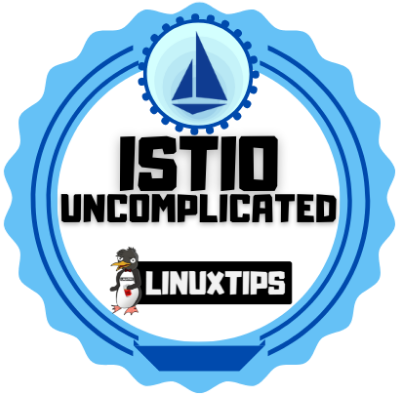
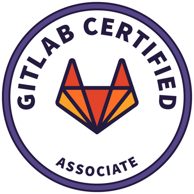

# Portifolio
This is my portifolio with all my knowledge and projects realted to DevOps

## Structure ##
The structure chosen to highlight all my knowledge base and skills was based on the [devOps roundMap](https://roadmap.sh/devops)

* [x] 💥 Remove the image and onely leave the href

## 🎓 My Knowledge base & Projects ##

* [Programing Languages](Programing_Languages/summary.md)
  * ⭐[Python](Programing_Languages/Python/summary.md)
  * [Ruby](Programing_Languages/Ruby/summary.md)
  * [Node.js](Programing_Languages/NodeJs/summary.md)
  * ⭐[Go](Programing_Languages/Go/summary.md)
  * [Rust](Programing_Languages/Rust/summary.md)
  * [C](Programing_Languages/C/summary.md)
  * [C++](Programing_Languages/C++/summary.md)
* [OS Conncepts]()
  * [Process Management]()
  * [Threads and Concurrency]()
  * [Sockets]()
  * [POSIX Basics]()
  * [Network Concepts]()
  * [Startuo Management (initd)]()
  * [Service Management (systemd)]()
  * [I/O Management]()
  * [Virtualization]()
  * [Memory & storage]()
  * [File Systems]()
* [Operation Systems](Operational_Systems/summary.md)
  * [Linux](Operational_Systems/Linux/summary.md)
    * ⭐[Suse Linux]()
    * [Debian]()
    * [Fedora]()
    * [Ubuntu]()
    * [CentOS]()
    * [RHEL]()
  * [Unix](Operational_Systems/Unix/summary.md)
    * [FreeBSD]()
    * [OpenBSD]()
    * [NetBSD]()
  * [Windows](Operational_Systems/Windows/summary.md)
* [Terminal utilization](Terminal_Utilization/summary.md)
  * ⭐[Bash scripting](Terminal_Utilization/Bash_scripting/summary.md)
  * ⭐[Vim/Nano]()
  * [Compiling apps from source]()
  * [System Performance]()
  * [Text Manipulation Tools]()
  * [Process Monitoring]()
  * [Network]()
  * [Others]()
* [Networking,Security and Protocols]()
  * [DNS]()
  * [OSI Model]()
  * [emails]()
    * [SMTP]()
    * [IMAPS]()
    * [POP3S]()
    * [DMARC]()
    * [SPF]()
    * [Domain Keys]()
    * [White / Grey Listing]()
    * [HTTP]()
    * [HTTPS]()
    * [FTP]()
    * [SSL / TLS]()
    * [SSH]()
    * [Port Fowarding]()
* [What is and how to setup a:]()
  * [Reverse Proxy]()
  * [Foward Proxy]()
  * [Caching Server]()
  * [Load Balancer]()
  * [Web Servers]()
    * [IIS]()
    * ⭐[Nginx]()
    * [Apache]()
    * [Tomcat]()
    * [Caddy]()
* [IAC](IAC/summary.md)
  * [Containers](IAC/Containers/summary.md)
    * ⭐[Docker](IAC/Containers/Docker/summary.md)
    * [LXC](IAC/Containers/LXC/summary.md)
  * [Configuration Management](IAC/Configuration_Management/summary.md))
    * ⭐[Ansible](IAC/Configuration_Management/Ansible/summary.md)
    * [Salt](IAC/Configuration_Management/Salt/summary.md)
    * [Chef](IAC/Configuration_Management/Chef/summary.md)
    * [Puppet](IAC/Configuration_Management/Puppet/summary.md)
  * [Container Orchestration](IAC/Container_Orchestration/summary.md)
    * ⭐[Kubernetes](IAC/Container_Orchestration/Kubernetes/summary.md)
    * [Mesos](IAC/Container_Orchestration/Mesos/summary.md)
    * [Docker Swarm](IAC/Container_Orchestration/Docker_Swarm/summary.md)
    * [Nomad](IAC/Container_Orchestration/Nomad/summary.md)
  * [Service Mash](IAC/Service_Mash/summary.md)
    * ⭐[Istio](IAC/Service_Mash/Istio/summary.md)
    * [Envoy](IAC/Service_Mash/Envoy/summary.md)
    * [Linkerd](IAC/Service_Mash/Linkerd/summary.md)
    * [Consul](IAC/Service_Mash/Consul/summary.md)
* [CI/CD]()
  * [Gitlab]()
  * [GitHub Actions]()
  * [Bamboo]()
  * [Azure Devops]()
  * [Jenkins]()
  * [Travis CI]()
  * [TeamCity]()
  * [Circle CI]()
* [Infraestructure Provisioning]()
  * ⭐[Terraform]()
  * [CloudFormation]()
  * [Pulumi]()
* [Monitoring Software and Infraestructure]()
  * [Infraestructure Monitoring]()
    * ⭐[Prometheus]()
    * [Nagios]()
    * ⭐[Grafana]()
    * [Zabbix]()
    * [Monit]()
    * [Datadog]()
  * [Aplication Monitoring]()
    * ⭐[Jaeger]()
    * [New Relic]()
    * [App Dynamics]()
    * [Istana]()
    * [OpenTracing]()
* [Cloud Providers](Cloud_Providers/summary.md)
  * ⭐[AWS](Cloud_Providers/AWS/sumamary.md)
  * [Google Cloud](Cloud_Providers/Google_Cloud/sumamary.md)
  * [Azure](Cloud_Providers/Azure/sumamary.md)
  * [Heroku](Cloud_Providers/Heroku/sumamary.md)
  * [Oracle Cloud](Cloud_Providers/Oracle_Cloud/sumamary.md)
  * [IBM Cloud](Cloud_Providers/IBM_Cloud/sumamary.md)
  * [Alibaba Cloud](Cloud_Providers/Alibaba_Cloud/sumamary.md)
* [Cloud Desing Patterns]()
  * [Availability]()
  * [Data Management]()
  * [Desing and Implementation]()
  * [Management and Monitoring]()
* [Others](Others/summary.md)
  * [Git](Others/Git/summary.md)

## Latest Courses ##

## Latest Certifications ##

## Badges ##
<table width="100%" border="0">
  <tr>    
    <td></td>
    <td></td>
    <td></td>
    <td></td>
    <td></td>
    <td></td>
    <td></td>
    <td></td>
  </tr>
</table>

## 🚧 TO-DO List 🚧 ##
<!-- TO-DO List -->
* [ Review links ] ...
* [ ] ...
* [ ] ...
* [ ] ...
